# z_01.md — Алгоритм решения практической работы №1
## «Обработка и анализ данных с использованием экосистемы Hadoop и Apache Spark (PySpark)»

---

## 1. Постановка задачи

### 1.1. Бизнес-контекст
Современная организация (компания, госорган, исследовательский центр) ежедневно накапливает большие объёмы данных в разнородных источниках. Для принятия управленческих решений эти данные необходимо:

1. **Собрать** в единое распределённое хранилище.
2. **Очистить** от пропусков, дубликатов, ошибок типизации.
3. **Проанализировать** с помощью SQL-подобных запросов (агрегации, группировки, фильтры).
4. **Визуализировать** для интерпретации руководством.

В качестве иллюстративного бизнес-кейса в эталонном решении (`work_with_data_2024_v2.ipynb`) рассматривается **анализ макроэкономических показателей (GDP по странам и годам)** — задача, типичная для аналитического департамента в банке, консалтинге или государственном статистическом ведомстве. Студент по своему варианту подбирает аналогичный по структуре датасет на Kaggle / UCI / GitHub либо генерирует синтетический.

### 1.2. Техническая задача
Используя **HDFS** как распределённое хранилище и **Apache Spark (PySpark)** как вычислительный движок, выполнить полный ETL-цикл:

```
ИСТОЧНИК (CSV) → HDFS → Spark DataFrame → очистка → Spark SQL → визуализация → отчёт
```

### 1.3. Среда выполнения — что выбрать

| Вариант | Когда использовать | Плюсы | Минусы |
|---|---|---|---|
| **ВМ `ds_mgpu_Hadoop3+spark_3_4.ova` в VirtualBox 7.0.20** ← **приоритет по методичке** | Если есть ≥ 8 ГБ ОЗУ и возможность поставить VirtualBox | Полноценный HDFS, доказательства работы кластера (jps, web UI 9870/8088), полное соответствие критерию №1 (3 балла за «работу с HDFS и средой») | Тяжёлая (~5–8 ГБ), требует установки |
| **Google Colab + `!pip install pyspark`** | Если ВМ не запускается / нет ресурсов | Быстрый старт, ничего ставить не надо | **HDFS отсутствует** — теряется до 2 баллов из 3 за «техническую часть»; чтение идёт с локального диска Colab, а не с `hdfs://...` |

> **Рекомендация:** основной путь — **ВМ `ds_mgpu_Hadoop3+spark_3_4`**. Colab оставить как резервный вариант для отладки PySpark-кода без HDFS. Идеально — отладить логику в Colab, затем повторить запуск в ВМ с реальной загрузкой в `hdfs://localhost:9000/...` и сделать скриншоты.

---

## 2. Схема решения (Mermaid)

```mermaid
flowchart TD
    Start([Старт работы]) --> Choice{Выбор среды}

    Choice -->|Приоритет| VM[ВМ ds_mgpu_Hadoop3+spark_3_4<br/>в VirtualBox 7.0.20]
    Choice -->|Резерв| Colab[Google Colab<br/>!pip install pyspark]

    VM --> Login[sudo su - hadoop]
    Login --> StartCluster[start-dfs.sh<br/>start-yarn.sh]
    StartCluster --> CheckJps[jps:<br/>NameNode, DataNode,<br/>ResourceManager, NodeManager]
    CheckJps --> WebUI[Скриншоты Web UI:<br/>HDFS :9870<br/>YARN :8088]

    WebUI --> Dataset[Выбор датасета по варианту<br/>Kaggle / UCI / GitHub]
    Colab --> Dataset

    Dataset --> MkDir[hdfs dfs -mkdir -p<br/>/user/hadoop/lab_01/input]
    MkDir --> Chmod[hdfs dfs -chmod 775<br/>/user/hadoop/lab_01]
    Chmod --> Put[hdfs dfs -put data.csv<br/>/user/hadoop/lab_01/input/]
    Put --> LsCheck[hdfs dfs -ls<br/>СКРИНШОТ]

    LsCheck --> SparkInit[SparkSession.builder<br/>.appName Lab1<br/>.master local *]
    Colab --> SparkInit

    SparkInit --> Read[spark.read.csv<br/>hdfs://localhost:9000/...<br/>header=true, inferSchema=true]

    Read --> ETL[ЗАДАНИЕ 1: ETL]
    ETL --> Schema[printSchema<br/>show 5]
    Schema --> Nulls[Обработка NULL:<br/>dropna / fillna]
    Nulls --> Dupes[Удаление дубликатов:<br/>dropDuplicates]
    Dupes --> Cast[Приведение типов:<br/>withColumn cast]

    Cast --> SQL[ЗАДАНИЕ 2: Spark SQL]
    SQL --> CreateView[createOrReplaceTempView]
    CreateView --> Queries[Запросы:<br/>GROUP BY, агрегации,<br/>оконные функции,<br/>фильтры, JOIN]
    Queries --> Results[Сохранить результаты<br/>в pandas через toPandas]

    Results --> Viz[ЗАДАНИЕ 3: Визуализация]
    Viz --> Plots[matplotlib / seaborn:<br/>title, xlabel, ylabel,<br/>legend, grid]
    Plots --> Interpret[Бизнес-интерпретация<br/>каждого графика]

    Interpret --> Save[Сохранение результатов<br/>в HDFS:<br/>df.write.csv hdfs://...]
    Save --> Stop[stop-yarn.sh<br/>stop-dfs.sh]

    Stop --> Repo[GitHub / GitVerse:<br/>README.md<br/>lab_01.ipynb<br/>Report.md]
    Repo --> Moodle([Сдача в Moodle])

    style VM fill:#c8e6c9
    style Colab fill:#fff9c4
    style ETL fill:#bbdefb
    style SQL fill:#bbdefb
    style Viz fill:#bbdefb
    style Moodle fill:#ffccbc
```



---

## 3. Пошаговый алгоритм

### Шаг 0. Подготовка среды (один раз)

**Путь А — ВМ (приоритет):**
1. Установить **VirtualBox 7.0.20** + **Extension Pack 7**.
2. Импортировать `ds_mgpu_Hadoop3+spark_3_4.ova` (Файл → Импорт конфигураций).
3. В настройках ВМ выделить ≥ 4 ГБ ОЗУ, 2 CPU, включить сеть (NAT).
4. Запустить ВМ, войти под `hadoop` (пароль см. в материалах курса).

**Путь Б — Colab (резерв):**
- Открыть https://colab.research.google.com → новый notebook → первая ячейка: `!pip install pyspark`.

### Шаг 1. Запуск кластера Hadoop (только в ВМ)

```bash
sudo su - hadoop
start-dfs.sh          # NameNode + DataNode
start-yarn.sh         # ResourceManager + NodeManager
jps                   # должно показать 4+ процесса
```

**Скриншот №1 для отчёта:** вывод `jps`.
**Скриншот №2 для отчёта:** Web UI `http://localhost:9870` (HDFS NameNode).

### Шаг 2. Подготовка HDFS и загрузка датасета

```bash
# Создаём директорию проекта
hdfs dfs -mkdir -p /user/hadoop/lab_01/input

# Выдаём права (если требуется коллаборация)
hdfs dfs -chmod 775 /user/hadoop/lab_01

# Кладём локальный CSV в HDFS
hdfs dfs -put /home/hadoop/Downloads/data/*.csv /user/hadoop/lab_01/input/

# Проверяем
hdfs dfs -ls /user/hadoop/lab_01/input/
```

**Скриншот №3 для отчёта:** результат `hdfs dfs -ls`.

> **Типовая ошибка:** `Permission denied` при записи — лечится `hdfs dfs -chmod 777 <путь>` (как и отмечено в эталонном ноутбуке, ячейка 10–11).

### Шаг 3. Инициализация Spark и чтение из HDFS

```python
from pyspark.sql import SparkSession
from pyspark.sql.functions import col, avg, sum as _sum, desc, count, when

spark = SparkSession.builder \
    .appName("Lab1_BusinessInformatics") \
    .master("local[*]") \
    .config("spark.hadoop.fs.defaultFS", "hdfs://localhost:9000") \
    .config("spark.sql.shuffle.partitions", "50") \
    .getOrCreate()

# В ВМ — читаем из HDFS:
df = spark.read.option("header", "true") \
                .option("inferSchema", "true") \
                .csv("hdfs://localhost:9000/user/hadoop/lab_01/input/ваш_файл.csv")

# В Colab — читаем с локального диска / Google Drive:
# df = spark.read.csv("/content/ваш_файл.csv", header=True, inferSchema=True)

df.printSchema()
df.show(5)
```

### Шаг 4. ЗАДАНИЕ 1 — ETL (Spark DataFrame API)

```python
# 4.1 Проверка пропусков
df.select([count(when(col(c).isNull(), c)).alias(c) for c in df.columns]).show()

# 4.2 Удаление полностью пустых строк
df_clean = df.dropna(how="all")

# 4.3 Удаление дубликатов
df_clean = df_clean.dropDuplicates()

# 4.4 Приведение типов (пример)
df_clean = df_clean.withColumn("Year", col("Year").cast("int")) \
                   .withColumn("GDP",  col("GDP").cast("double"))

print(f"Строк после очистки: {df_clean.count()}")
df_clean.printSchema()
```

### Шаг 5. ЗАДАНИЕ 2 — Аналитика через Spark SQL

```python
df_clean.createOrReplaceTempView("data_view")

# Пример сложного запроса: топ-5 стран по среднему GDP за последние 10 лет
top_countries = spark.sql("""
    SELECT Country,
           AVG(GDP)  AS avg_gdp,
           MAX(GDP)  AS max_gdp,
           MIN(GDP)  AS min_gdp,
           COUNT(*)  AS n_obs
    FROM   data_view
    WHERE  Year >= 2014
    GROUP  BY Country
    ORDER  BY avg_gdp DESC
    LIMIT  5
""")
top_countries.show()
```

Минимум **3–4 разных запроса** (агрегация / группировка / сортировка / фильтр / JOIN или оконная функция) — для получения 2 баллов за критерий «Spark SQL».

### Шаг 6. ЗАДАНИЕ 3 — Визуализация и интерпретация

```python
import matplotlib.pyplot as plt

pdf = top_countries.toPandas()           # переводим МАЛЕНЬКИЙ результат в pandas

plt.figure(figsize=(10, 6))
plt.bar(pdf["Country"], pdf["avg_gdp"])
plt.title("Топ-5 стран по среднему ВВП (2014–...)")
plt.xlabel("Страна")
plt.ylabel("Средний GDP")
plt.grid(axis="y", alpha=0.3)
plt.tight_layout()
plt.savefig("fig_top5_gdp.png", dpi=150)
plt.show()
```

**Под каждым графиком — текстовая интерпретация:** «График показывает, что страна X лидирует по среднему ВВП за период, что свидетельствует о… Для бизнеса это означает…».

### Шаг 7. Сохранение результата обратно в HDFS

```python
top_countries.write.mode("overwrite") \
    .csv("hdfs://localhost:9000/user/hadoop/lab_01/output/top_countries")
```

Проверка из терминала: `hdfs dfs -ls /user/hadoop/lab_01/output/top_countries`.

### Шаг 8. Остановка кластера

```bash
stop-yarn.sh
stop-dfs.sh
# либо
stop-all.sh
```

---

## 4. Оформление репозитория (под критерии оценки)

```
lab_01_BI/
├── README.md          # цель, вариант, ссылка на датасет, инструкция запуска
├── lab_01.ipynb       # код с комментариями (можно за основу взять work_with_data_2024_v2.ipynb)
├── Report.md          # или Report.pdf
├── data/
│   └── sample.csv     # небольшой пример (полный — ссылкой)
└── screenshots/
    ├── 01_jps.png
    ├── 02_hdfs_web_ui.png
    ├── 03_hdfs_ls.png
    └── 04_plot_*.png
```

**README.md — обязательные блоки:**
- Описание задачи и выбранного варианта.
- Источник данных (прямая ссылка).
- Команды запуска (`start-dfs.sh`, `jupyter notebook`, …).

**Report.md — обязательные блоки** (по критериям оценки):
1. **Введение** — цель, бизнес-задача, описание данных.
2. **Ход работы** — скриншоты HDFS + код предобработки.
3. **Анализ** — SQL-запросы + таблицы + графики с интерпретацией.
4. **Выводы** — применимость Hadoop/Spark к данной задаче.

---

## 5. Сопоставление шагов с критериями оценки (10 баллов)

| Критерий | Балл | Где закрывается в алгоритме |
|---|---|---|
| Развёртывание среды, HDFS, скриншоты | 1 | Шаги 1–2 |
| Права доступа и структура папок | 1 | Шаг 2 (`mkdir -p`, `chmod`) |
| Чтение в Spark по `hdfs://...` | 1 | Шаг 3 |
| ETL (NULL, дубликаты, типы) | 1 | Шаг 4 |
| Spark SQL (сложные запросы) | 2 | Шаг 5 |
| Графики с подписями | 1 | Шаг 6 |
| Бизнес-интерпретация | 1 | Шаг 6 (текст под графиками) |
| Репозиторий + README | 1 | Раздел 4 |
| Отчёт с выводами | 1 | Раздел 4 (Report.md) |
| **ИТОГО** | **10** |  |

---

## 6. Полезные ссылки

- Методичка: https://github.com/BosenkoTM/BigDataWork/blob/main/practice/2026/pw_01/pw_01.md
- Эталонное решение (stand-alone): https://github.com/BosenkoTM/BigDataWork/blob/main/practice/2026/pw_01/решение%20stand-alone/big_data/2026/work_with_data_2024_v2.ipynb
- VirtualBox 7.0.20: https://disk.yandex.ru/d/VjDA4Zv8Ai-HXg
- Extension Pack 7: https://disk.yandex.ru/d/iTOWdldba0prcA
- ВМ `ds_mgpu_Hadoop3+spark_3_4.ova`: https://disk.yandex.ru/d/zEKP6GY6Nosaxg
