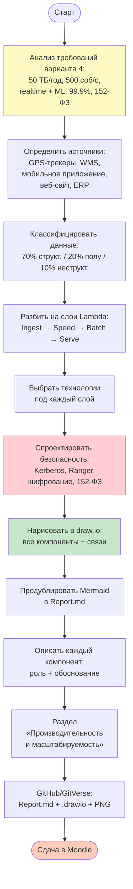
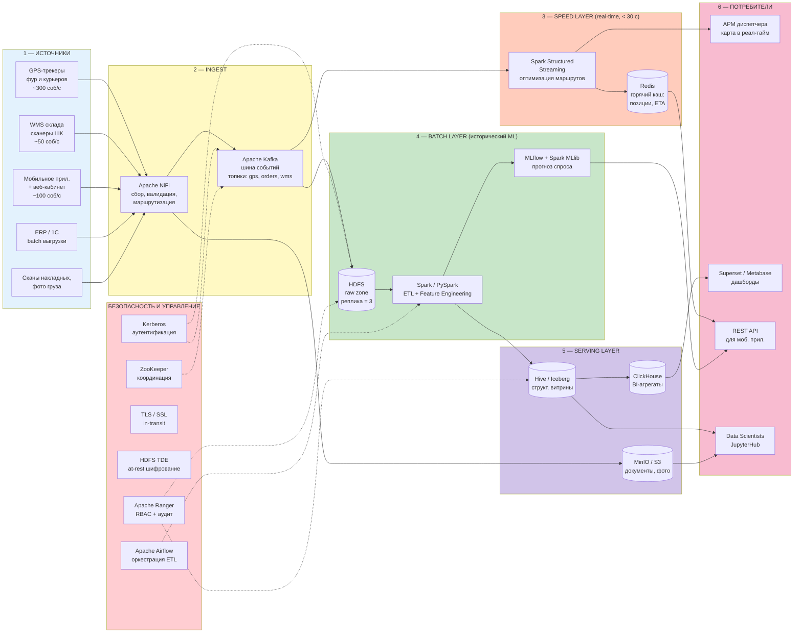

# z_02.md — Алгоритм решения практической работы №2
## «Проектирование архитектуры BigData-системы»
### Вариант 4. Логистическая компания

---

## 1. Постановка задачи

### 1.1. Бизнес-контекст
Крупная логистическая компания (федеральный курьерский / грузовой оператор) обрабатывает потоки данных от трёх ключевых источников: транспорт (GPS-трекеры, телематика грузовиков), складские системы (WMS, сканеры штрих-кодов) и клиентский контур (мобильное приложение, веб-кабинет, контакт-центр). На основе этих данных бизнесу необходимо:

1. **Оптимизировать маршруты в реальном времени** — пересчитывать оптимальный путь курьера/фуры при пробках, отказах клиентов, новых заказах.
2. **Прогнозировать спрос** — заранее размещать машины и персонал в районах с ожидаемым ростом заказов.
3. **Соответствовать законодательству РФ** — 152-ФЗ «О персональных данных» (ФИО, адреса, телефоны получателей).

### 1.2. Технические требования (вариант 4)

| Параметр | Значение | Архитектурное следствие |
|---|---|---|
| Объём данных | **50 ТБ/год**, рост **25 %** ежегодно (через 5 лет — ~150 ТБ) | Нужно горизонтально масштабируемое хранилище (HDFS / S3-совместимое) |
| Скорость поступления | **до 500 событий/сек** | Нужна стриминговая шина (Kafka) + потоковый обработчик (Spark Streaming / Flink) |
| Типы данных | 70 % структурированные / 20 % полу- / 10 % неструктурированные | Полиглот-хранилище: HDFS (raw) + Hive/Iceberg (структурированные) + объектное хранилище для документов/фото |
| Обработка | Реал-тайм маршруты + ML-прогноз спроса | Lambda-архитектура: **speed layer** (стрим) + **batch layer** (исторический ML) |
| Доступность | **99,9 %** (≈ 8,76 ч простоя в год) | Кластер ≥ 3 узлов, репликация HDFS = 3, резервный ЦОД |
| Время отклика | **< 30 с** | Кэш в Redis для агрегатов, индексы в ClickHouse/Druid для BI |
| Безопасность | Базовое шифрование + **152-ФЗ** | Kerberos + Apache Ranger + шифрование at-rest (HDFS TDE) и in-transit (TLS) + размещение ПДн **на территории РФ** |

### 1.3. Что должно быть в результате
1. **Анализ требований** (этот раздел).
2. **Выбор компонентов** с обоснованием.
3. **Диаграмма архитектуры в draw.io** (`architecture.drawio` + экспорт PNG/SVG).
4. **Mermaid-схема** в отчёте (быстро редактируется, версионируется в git).
5. **Описание каждого компонента** (роль, функция, почему выбран).
6. **Раздел «Производительность и масштабируемость»** с расчётами.

---

## 2. Схема решения (Mermaid)

### 2.1. Алгоритм проектирования (что делать студенту)



### 2.2. Целевая архитектура (Lambda) — вариант 4



---

## 3. Пошаговый алгоритм выполнения

### Шаг 1. Анализ требований (раздел 1 отчёта)
Расписать таблицу из п. 1.2 своими словами, добавить **расчёт нагрузки**:

```
500 событий/с × 1 КБ среднее = 500 КБ/с = 43 ГБ/сутки сырых событий
                                       ≈ 15,7 ТБ/год сырых потоков
+ batch-выгрузки из ERP/WMS          ≈ 35 ТБ/год
ИТОГО                                ≈ 50 ТБ/год  ✓ (сходится с условием)

С учётом реплики HDFS = 3:           50 × 3 = 150 ТБ полезной ёмкости/год
Через 5 лет при росте 25%:           50 × (1.25^5) ≈ 153 ТБ/год → ~460 ТБ с репликой
```

### Шаг 2. Определение источников данных

| Источник | Тип | Скорость | Формат | Доля |
|---|---|---|---|---|
| GPS-трекеры транспорта | Поток | ~300 соб/с | JSON | Структурированный |
| WMS / сканеры ШК | Поток + batch | ~50 соб/с | JSON / CSV | Структурированный |
| Мобильное приложение | Поток (event) | ~100 соб/с | JSON | Полуструктурированный |
| ERP / 1C | Batch (раз в час) | — | CSV / XML | Структурированный |
| Сканы накладных, фото груза | Загрузка по событию | ~50 файлов/с | PDF / JPG | Неструктурированный |

### Шаг 3. Выбор компонентов архитектуры

#### 3.1. Распределённое хранилище — **HDFS** (основное) + **MinIO/S3** (объектное)

**Почему HDFS, а не «голый» S3:**
- Эталон курса (`ds_mgpu_Hadoop3+spark_3_4`) — HDFS, есть локальная экспертиза.
- 152-ФЗ требует размещения ПДн **на территории РФ** → on-premise HDFS закрывает требование без юридических рисков AWS.
- Высокая пропускная способность для Spark-задач (data locality).

**Почему дополнительно MinIO (S3-совместимый):**
- Хранение неструктурированных файлов (PDF, JPG) — для них HDFS неоптимален (много мелких файлов = «small files problem»).

#### 3.2. Шина данных — **Apache Kafka** + **Apache NiFi**
- **Kafka** — стандарт для 500+ соб/с, горизонтально масштабируется, гарантирует доставку (replication factor = 3).
- **NiFi** — графический конструктор для сбора из разнородных источников (GPS, HTTP, JDBC, файлы) с валидацией «на лету».

#### 3.3. Обработка — **Apache Spark** (batch) + **Spark Structured Streaming** (real-time)
- Единый стек: один и тот же код на PySpark и для batch, и для стрима (микро-батчи 1–5 с укладываются в SLA «< 30 с»).
- Альтернатива Flink не выбрана: команда уже знает Spark, требование «< 30 с» не настолько жёсткое, чтобы переходить на event-time Flink.

#### 3.4. Витрины и BI — **Hive/Iceberg** + **ClickHouse** + **Redis**
- **Hive / Iceberg** — SQL поверх HDFS для аналитиков и Data Scientists.
- **ClickHouse** — субсекундные ответы для дашбордов руководства (тысячи запросов/мин).
- **Redis** — горячий кэш (текущие координаты курьеров, ETA доставки) — отдача за единицы миллисекунд в мобильное приложение.

#### 3.5. ML — **Spark MLlib** + **MLflow**
- Прогноз спроса (Gradient Boosting / ARIMA) обучается ночью на исторических данных HDFS, модель версионируется в MLflow, выкатывается в Spark Streaming.

#### 3.6. Оркестрация — **Apache Airflow**
- DAG-и расписывают ночные ETL, переобучение моделей, бэкапы.

#### 3.7. Безопасность (под 152-ФЗ)
| Компонент | Назначение |
|---|---|
| **Kerberos** | Аутентификация всех сервисов (Hadoop, Kafka, Hive) |
| **Apache Ranger** | RBAC: разграничение доступа к таблицам/колонкам (например, телефон клиента виден только оператору КЦ) |
| **TLS/SSL** | Шифрование in-transit между всеми компонентами |
| **HDFS TDE** (Transparent Data Encryption) | Шифрование at-rest для зон с ПДн |
| **Аудит-логи Ranger** | Журналирование доступа — требование 152-ФЗ |
| **Размещение в РФ** | ЦОД на территории России |

### Шаг 4. Создание диаграммы в draw.io

1. Открыть https://app.diagrams.net (или desktop-версию).
2. **File → New → Blank Diagram**, сохранять как `architecture.drawio`.
3. Использовать готовые шейпы:
   - Левая панель → **More Shapes** → включить **Networking → AWS / GCP / Azure** и **Software → Cisco**.
   - Для Hadoop-экосистемы — поиск в шейпах: «Hadoop», «Kafka», «Spark», «HDFS».
4. **Расположение по слоям** (слева направо): Источники → Ingest → Speed/Batch → Serving → Потребители. Безопасность — отдельный «обвес» снизу.
5. **Связи**: сплошные стрелки — поток данных, пунктирные — управление/безопасность.
6. **Цветовое кодирование слоёв** (как в Mermaid-схеме выше).
7. Экспорт: **File → Export as → PNG** (для отчёта) и **SVG** (для масштабирования без потерь).
8. Файл `.drawio` обязательно положить в репозиторий — преподаватель может проверить редактируемость.

### Шаг 5. Описание компонентов (для отчёта)

Формат для каждого компонента:

> **Apache Kafka**
> **Роль:** распределённая шина сообщений между источниками и обработчиками.
> **Функции:** приём 500+ событий/с с гарантией at-least-once, буферизация при пиковых нагрузках, разделение топиков по типу данных (gps, orders, wms).
> **Почему выбран:** индустриальный стандарт, горизонтальное масштабирование добавлением брокеров, нативная интеграция со Spark Streaming.
> **Альтернативы:** RabbitMQ (не тянет 500+ соб/с устойчиво), Apache Pulsar (меньше экспертизы в команде).

Аналогично — для всех ~15 компонентов схемы.

### Шаг 6. Производительность и масштабируемость

**Производительность:**
- **Speed layer < 30 с:** Kafka (≈ 10 мс) → Spark micro-batch 5 с → Redis (≈ 1 мс) → клиент. Запас в 5× к SLA.
- **BI-запросы:** ClickHouse даёт субсекундные ответы на агрегатах до 10 млрд строк.
- **ML-инференс:** модель прогноза спроса в памяти Spark Streaming, < 100 мс на запрос.

**Масштабируемость (рост 25 %/год):**
- **HDFS** — линейное расширение добавлением DataNode (через 5 лет нужен кластер 12–15 узлов вместо 3–4).
- **Kafka** — добавление брокеров и партиций топиков (при 500 соб/с → возможен рост до 5 000+ соб/с без смены технологии).
- **Spark** — добавление NodeManager-ов в YARN.
- **ClickHouse** — шардирование по дате/региону.

**Высокая доступность (99,9 %):**
- HDFS NameNode HA (active + standby через ZooKeeper).
- Kafka replication factor = 3, `min.insync.replicas = 2`.
- Spark — авторестарт стрим-джоб через checkpoint в HDFS.
- Резервный ЦОД с асинхронной репликацией (RPO ≈ 15 мин).

---

## 4. Структура репозитория

```
lab_02_BI/
├── README.md             # описание варианта 4 + инструкция
├── Report.md             # или Report.pdf — основной отчёт
├── diagrams/
│   ├── architecture.drawio   # ОБЯЗАТЕЛЬНО — редактируемый исходник
│   ├── architecture.png      # экспорт для просмотра
│   └── architecture.svg      # экспорт для масштабирования
└── docs/
    └── components.md         # таблица описаний компонентов
```

**Report.md должен содержать:**
1. Введение и постановка (раздел 1 этого документа).
2. Анализ требований с расчётом нагрузки (Шаг 1).
3. Источники и типы данных (Шаг 2).
4. Архитектурная схема (PNG из draw.io + дублирующая Mermaid).
5. Описание каждого компонента с обоснованием (Шаг 5).
6. Безопасность и 152-ФЗ (Шаг 3.7).
7. Производительность и масштабируемость (Шаг 6).
8. Выводы.

---

## 5. Чек-лист самопроверки

- [ ] В отчёте есть **расчёт** объёма данных (не просто «50 ТБ из условия»).
- [ ] Каждый из **трёх типов данных** (структ./полу/неструкт.) явно отнесён к компоненту хранения.
- [ ] Архитектура нарисована **именно в draw.io** (файл `.drawio` в репо), а не только Mermaid.
- [ ] Закрыты **все цифры из условия**: 50 ТБ, 25 %, 500 соб/с, 99,9 %, < 30 с.
- [ ] **152-ФЗ** упомянут не одной строкой, а с конкретными мерами (Ranger, TDE, ЦОД в РФ).
- [ ] Для каждого выбора есть **обоснование** и хотя бы одна альтернатива (почему не она).
- [ ] Раздел «Масштабируемость» показывает, как система выдержит **рост 25 %/год** на горизонте 5 лет.

---

## 6. Полезные ссылки

- draw.io online: https://app.diagrams.net
- Шейпы Hadoop/Kafka/Spark: библиотека **Software** → **Apache** в draw.io
- Apache NiFi: https://nifi.apache.org
- Apache Ranger (политики безопасности): https://ranger.apache.org
- 152-ФЗ (актуальная редакция): http://www.consultant.ru/document/cons_doc_LAW_61801/
- Lambda Architecture: http://lambda-architecture.net
