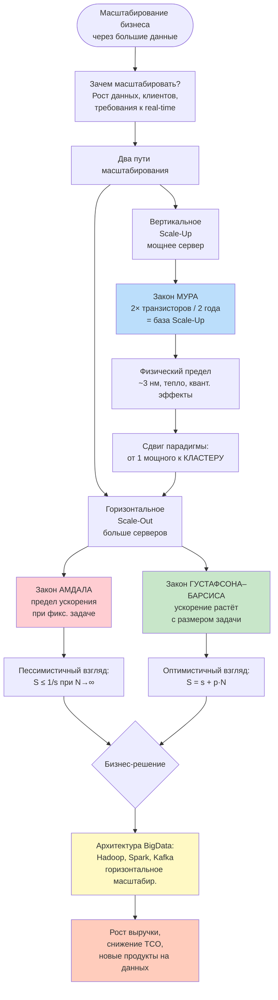
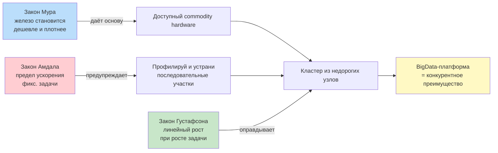

# z_03.md — Масштабирование бизнеса с использованием больших данных
## Закон Мура, закон Амдала, закон Густафсона–Барсиса

---

## 1. Постановка вопроса

Современный бизнес сталкивается с экспоненциальным ростом данных: телеметрия IoT, логи приложений, транзакции, медиаконтент. Чтобы превращать данные в конкурентное преимущество, компания должна **масштабироваться** — наращивать вычислительную мощность и хранилище быстрее, чем растут данные и нагрузка.

Три фундаментальных закона определяют **границы возможного** при таком масштабировании:

| Закон | О чём | Что отвечает бизнесу |
|---|---|---|
| **Мура** | Рост плотности транзисторов / производительности «железа» | *«Стоит ли ждать, пока железо подешевеет, или строить кластер сейчас?»* |
| **Амдала** | Предел ускорения при фиксированной задаче и росте числа ядер | *«Сколько серверов имеет смысл купить?»* |
| **Густафсона–Барсиса** | Ускорение при росте размера задачи вместе с числом ядер | *«Окупится ли масштабирование, если мы будем обрабатывать больше данных?»* |

Бизнес-информатику важно понимать **все три закона вместе**: Мур задаёт темп удешевления, Амдал — пессимистическую границу, Густафсон — оптимистическую (которая фактически и работает в BigData).

---

## 2. Схема ответа (Mermaid)



---

## 3. Масштабирование бизнеса с использованием больших данных

### 3.1. Что значит «масштабировать бизнес данными»
Большие данные перестают быть «побочным продуктом» работы ИТ-систем и становятся **самостоятельным фактором роста**:

1. **Продуктовое масштабирование** — персонализация (рекомендательные системы Wildberries, Ozon), динамическое ценообразование (Яндекс.Такси), предиктивное обслуживание (Сбер, РЖД).
2. **Операционное масштабирование** — автоматизация принятия решений, прогноз спроса, оптимизация цепочек поставок.
3. **Финансовое масштабирование** — снижение удельной стоимости обработки одного события (cost per event) при росте объёмов.

### 3.2. Два пути масштабирования инфраструктуры

| Параметр | Scale-Up (вертикальное) | Scale-Out (горизонтальное) |
|---|---|---|
| Суть | Один мощный сервер: больше CPU, RAM, дисков | Кластер из множества обычных узлов |
| Предел | Физический (закон Мура замедляется) | Программный (закон Амдала) |
| Стоимость | Растёт нелинейно (high-end сервер дороже 10 обычных в 30 раз) | Растёт линейно (commodity hardware) |
| Отказоустойчивость | Низкая — один сервер = одна точка отказа | Высокая — потеря узла не критична |
| Применение | OLTP, классические СУБД (Oracle, MS SQL) | BigData (Hadoop, Spark, Kafka, ClickHouse) |

**Ключевой вывод:** BigData-стек (HDFS, Spark, Kafka) с самого начала проектируется под **горизонтальное масштабирование** — это снимает зависимость бизнеса от закона Мура и переводит её в плоскость законов Амдала и Густафсона.

---

## 4. Закон Мура

### 4.1. Формулировка
> Гордон Мур, сооснователь Intel, 1965 г.:
> **«Количество транзисторов на кристалле интегральной микросхемы удваивается приблизительно каждые 2 года (изначально — каждый год)».**

Эмпирическое следствие: производительность процессоров и плотность памяти растёт экспоненциально, а удельная стоимость — падает.

### 4.2. Математическая модель

$$
N(t) = N_0 \cdot 2^{t/T}, \quad T \approx 2 \text{ года}
$$

где $N(t)$ — число транзисторов в момент времени $t$, $N_0$ — базовое значение.

### 4.3. Пример расчёта (бизнес-кейс)
Компания в 2015 г. купила сервер с 16 ядрами за 500 тыс. ₽.
Через 10 лет (2025 г.) при сохранении темпа Мура:

$$
\text{Производительность} \times 2^{10/2} = 2^5 = 32 \text{ раза}
$$

Сегодня за те же деньги (с учётом инфляции) — сервер уровня 256–512 ядер. **Отложить покупку на 2 года = получить вдвое больше мощности за те же деньги.**

### 4.4. Замедление закона Мура (2015 → настоящее)
- Физический предел литографии ≈ 2–3 нм (квантовые эффекты, туннелирование).
- Тепловыделение растёт быстрее, чем эффективность.
- Удвоение происходит уже не за 2, а за 2,5–3 года.

### 4.5. Что это значит для бизнеса
1. **Нельзя бесконечно «ждать более мощного железа»** — рост замедлился, выручка ждать не может.
2. Эпоха одиночного «суперкомпьютера» закончилась — компании переходят на **commodity hardware + распределённые системы**.
3. Именно это сделало возможным появление Hadoop, Spark, Kafka, ClickHouse — они **компенсируют замедление Мура горизонтальным масштабированием**.

---

## 5. Закон Амдала (1967)

### 5.1. Формулировка
Если задача состоит из **последовательной** части $s$ (которую нельзя распараллелить) и **параллельной** части $p$, где $s + p = 1$, то ускорение $S$ при использовании $N$ процессоров:

$$
S(N) = \frac{1}{s + \dfrac{p}{N}}
$$

При $N \to \infty$:

$$
S_{\max} = \frac{1}{s}
$$

То есть **последовательная часть задаёт абсолютный предел ускорения** независимо от числа ядер.

### 5.2. Числовой пример

| Доля последовательной части $s$ | $S_{\max}$ (предел) | $S(100)$ | $S(1000)$ |
|---|---|---|---|
| 0 % (идеально) | ∞ | 100 | 1000 |
| 5 % | 20 | 16,8 | 19,6 |
| 10 % | 10 | 9,2 | 9,9 |
| 25 % | 4 | 3,9 | 4,0 |
| 50 % | 2 | 1,98 | 2,0 |

**Вывод:** даже если только **5 %** алгоритма последовательны, добавление узлов сверх ~20 практически бесполезно — кривая ускорения упирается в потолок.

### 5.3. График поведения

```
Ускорение S
   |
20 |________________ ← потолок при s=5%
   |    ╱
   |   ╱
10 |  ╱
   | ╱
   |╱
 1 +-----------------→ N (число процессоров)
   1   10   100  1000
```

### 5.4. Бизнес-интерпретация
- **Пессимистический закон**: показывает, **где нет смысла тратить деньги** на дополнительные серверы.
- **Профилирование критично**: перед масштабированием инфраструктуры — найти и распараллелить «узкое горлышко» (последовательные участки).
- В классических BI-витринах с большим объёмом «склейки» данных (JOIN-ы, оконные функции) последовательная доля может быть значительной → масштабирование даёт убывающую отдачу.

### 5.5. Типовые источники последовательной части в BigData
1. Чтение метаданных (NameNode в HDFS).
2. Shuffle-фаза в Spark (синхронизация между этапами).
3. Запись финального результата в одну таблицу/файл.
4. Координация через ZooKeeper.

---

## 6. Закон Густафсона–Барсиса (1988)

### 6.1. Формулировка
Джон Густафсон возразил Амдалу: **в реальности с ростом числа процессоров мы не решаем ту же задачу быстрее — мы решаем задачу БОЛЬШЕГО размера за то же время**.

$$
S(N) = s + p \cdot N = N - s \cdot (N - 1)
$$

где $s$ и $p$ — доли последовательной и параллельной части в **масштабированной** задаче.

### 6.2. Числовой пример

| $s$ | $N = 10$ | $N = 100$ | $N = 1000$ |
|---|---|---|---|
| 0 % | 10 | 100 | 1000 |
| 5 % | 9,55 | 95,05 | 950,05 |
| 10 % | 9,1 | 90,1 | 900,1 |
| 25 % | 7,75 | 75,25 | 750,25 |

**Вывод:** ускорение растёт **почти линейно** с числом процессоров — именно этот режим описывает реальный BigData-кластер.

### 6.3. Сравнение Амдал vs Густафсон

```
              Амдал                  Густафсон
              ─────                  ─────────
Задача:       фиксированная          растёт с N
Вопрос:       «Во сколько раз        «Во сколько раз больше данных
              быстрее?»               обработаем за то же время?»
Поведение:    выходит на плато       растёт почти линейно
Применение:   HPC, расчёт одной      BigData, обработка
              модели погоды           петабайтов логов
```

### 6.4. Бизнес-интерпретация
- **Оптимистический закон**, объясняющий, **почему Google, Yandex, Сбер строят кластеры на тысячи узлов**.
- Если бизнес растёт (больше клиентов → больше данных), удвоение кластера действительно даёт ≈ 2× пропускной способности.
- **Фундамент окупаемости** инвестиций в Hadoop / Spark / Kafka: чем больше данных, тем выше KPI кластера.

### 6.5. Почему BigData работает по Густафсону, а не по Амдалу
В классическом OLTP («посчитай одну транзакцию быстрее») — Амдал.
В BigData задача формулируется иначе: **«обработай ВСЕ данные за окно X»**. Каждый дополнительный узел не ускоряет старую задачу, а позволяет включить **новые данные** в обработку — и это масштабирование Густафсона.

---

## 7. Три закона вместе — практический вывод для бизнеса



### 7.1. Сводная таблица

| Закон | Формула | Что говорит бизнесу |
|---|---|---|
| **Мур** | $N(t) = N_0 \cdot 2^{t/2}$ | Железо дешевеет, но темп замедлился → не жди, строй кластер |
| **Амдал** | $S = \dfrac{1}{s + p/N}$ | Есть потолок ускорения — найди и устрани последовательные части |
| **Густафсон** | $S = s + p \cdot N$ | Расти вместе с данными — масштабирование окупается |

### 7.2. Финальный вывод
- **Закон Мура** объясняет, **почему BigData стал возможным** (дешёвое железо).
- **Закон Амдала** объясняет, **где границы** наивного масштабирования.
- **Закон Густафсона** объясняет, **почему BigData выгоден экономически**: рост бизнеса = рост данных = линейный возврат на инвестиции в кластер.

Грамотный бизнес-информатик при проектировании BigData-решения:
1. Опирается на **Мура** для прогноза стоимости железа на 3–5 лет вперёд.
2. Использует **Амдала** для аудита текущих ETL-пайплайнов (где «узкое горло»).
3. Обосновывает закупку кластера **Густафсоном** — «при росте данных в N раз пропускная способность вырастет также почти в N раз».

---

## 8. Источники

- Moore, G. E. *Cramming more components onto integrated circuits.* Electronics, 1965.
- Amdahl, G. M. *Validity of the single processor approach to achieving large scale computing capabilities.* AFIPS, 1967.
- Gustafson, J. L. *Reevaluating Amdahl's Law.* Communications of the ACM, 1988.
- Hennessy, J., Patterson, D. *Computer Architecture: A Quantitative Approach.* 6-е изд.
- Chambers, B., Zaharia, M. *Spark: The Definitive Guide.* O'Reilly, 2018.
