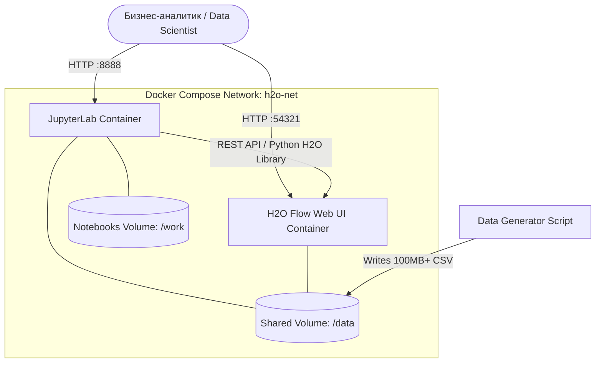

# Практическая работа 4. Прогнозирование оттока клиентов (Customer Churn) с использованием H2O.ai

## Описание задачи в области бизнес-аналитики
**Бизнес-проблема.** Телекоммуникационная компания теряет прибыль из-за оттока абонентов (Churn). Привлечение нового клиента обходится в 5-10 раз дороже, чем удержание текущего. 
**Цель.** Разработать предиктивную модель, которая на основе исторических данных о поведении абонентов (биллинг, обращения в поддержку, тип услуг) будет прогнозировать вероятность ухода клиента в следующем месяце.
**Бизнес-ценность:** 
1. Формирование целевых групп для маркетинговых кампаний (предложение скидок только тем, кто реально собирается уйти).
2. Оптимизация бюджета на удержание клиентов.
3. Повышение Customer Lifetime Value (CLTV).

## Архитектура решения

Для решения задачи мы разворачиваем изолированную среду с помощью Docker Compose. Среда состоит из вычислительного кластера H2O и рабочей среды Data Scientist'а (JupyterLab).



## Технологический стек
* **ОС:** Ubuntu 22.04 LTS
* **Инфраструктура:** Docker, Docker Compose (V2)
* **Язык программирования:** Python 3.10+
* **ML-платформа:** H2O-3 (Open Source) + H2O AutoML
* **IDE:** JupyterLab
* **Библиотеки:** `h2o`, `pandas`, `numpy`, `matplotlib`, `seaborn`, `scikit-learn`

---

## Подробные шаги решения задачи

### Шаг 1. Подготовка чистого рабочего места и инфраструктуры (Ubuntu 22.04)
Во избежание конфликтов портов остановите все текущие запущенные контейнеры (выполняйте, если уверены, что на сервере нет критичных сервисов):
```bash
docker ps -aq | xargs -r docker stop
```

Обновите систему и установите Docker, плагин Docker Compose V2 и утилиты для Python:
```bash
sudo apt update && sudo apt upgrade -y
sudo apt install -y docker.io docker-compose-plugin python3-pip python3-venv
sudo systemctl enable --now docker
sudo usermod -aG docker $USER
# Для применения прав группы docker перезайдите в систему или выполните:
newgrp docker
```

### Шаг 2. Создание структуры проекта
Создайте директорию для практической работы:
```bash
mkdir h2o-churn-project && cd h2o-churn-project
mkdir data notebooks
```

### Шаг 3. Подготовка Docker-файлов
В корневой папке проекта создайте файл `docker-compose.yml`:
```yaml
services:
  h2o-server:
    image: h2oai/h2o-open-source-k8s:latest
    container_name: h2o_cluster
    ports:
      - "54321:54321"
    volumes:
      - ./data:/data
    networks:
      - h2o-net

  jupyter:
    build: .
    container_name: jupyter_workspace
    ports:
      - "8888:8888"
    volumes:
      - ./data:/home/jovyan/data
      - ./notebooks:/home/jovyan/work
    environment:
      JUPYTER_ENABLE_LAB: "yes"
    networks:
      - h2o-net
    depends_on:
      - h2o-server

networks:
  h2o-net:
    driver: bridge
```

Создайте файл `Dockerfile` для сборки образа Jupyter с нужными библиотеками:
```dockerfile
FROM jupyter/scipy-notebook:latest
RUN pip install --no-cache-dir h2o pandas numpy polars pyarrow
```

### Шаг 4. Генерация данных (>100 МБ) с использованием venv
Нам нужен датасет размером более 100 МБ. Сначала создадим скрипт `generate_data.py` в корне проекта:

```python
# generate_data.py
import pandas as pd
import numpy as np
import os

print("Генерация данных. Это займет около 1-2 минут...")

n_rows = 1500000 # 1.5 млн строк дадут примерно 130 МБ

np.random.seed(42)

# Генерация фичей
customer_id = np.arange(1, n_rows + 1)
tenure_months = np.random.randint(1, 72, size=n_rows)
monthly_charges = np.random.uniform(20.0, 120.0, size=n_rows)
total_charges = tenure_months * monthly_charges * np.random.uniform(0.9, 1.1, size=n_rows)
tech_support_calls = np.random.poisson(lam=1.5, size=n_rows)
contract_type = np.random.choice(['Month-to-month', 'One year', 'Two year'], size=n_rows, p=[0.5, 0.3, 0.2])

# Логика оттока (Churn): чаще уходят клиенты с коротким стажем, высокими платежами и частыми звонками в саппорт
churn_prob = np.zeros(n_rows)
churn_prob += np.where(tenure_months < 12, 0.3, 0)
churn_prob += np.where(monthly_charges > 80, 0.2, 0)
churn_prob += np.where(tech_support_calls > 3, 0.4, 0)
churn_prob += np.where(contract_type == 'Month-to-month', 0.2, -0.2)

# Нормализация вероятностей и добавление шума
churn_prob = np.clip(churn_prob + np.random.normal(0, 0.1, size=n_rows), 0, 1)
churn = np.where(churn_prob > 0.5, 'Yes', 'No')

# Сборка DataFrame
df = pd.DataFrame({
    'CustomerID': customer_id,
    'TenureMonths': tenure_months,
    'MonthlyCharges': monthly_charges,
    'TotalCharges': total_charges,
    'TechSupportCalls': tech_support_calls,
    'ContractType': contract_type,
    'Churn': churn
})

output_path = 'data/telecom_churn.csv'
df.to_csv(output_path, index=False)

file_size_mb = os.path.getsize(output_path) / (1024 * 1024)
print(f"Данные успешно сгенерированы! Файл сохранен в {output_path}")
print(f"Количество строк: {n_rows}")
print(f"Размер файла: {file_size_mb:.2f} MB")
```

Для локального запуска скрипта на хостовой машине настроим виртуальное окружение:
```bash
# Создаем изолированное окружение
python3 -m venv venv

# Активируем его
source venv/bin/activate

# Устанавливаем необходимые пакеты
pip install pandas numpy

# Запускаем генерацию данных
python3 generate_data.py

# Деактивируем окружение (оно нам больше не понадобится)
deactivate
```

### Шаг 5. Запуск инфраструктуры
Используя современный синтаксис Compose V2, собираем образы и запускаем сервисы в фоновом режиме:
```bash
docker compose build --no-cache && docker compose up -d
```

После старта вы можете получить доступ к сервисам:
1. **H2O Flow UI:** `http://localhost:54321`
2. **JupyterLab:** `http://localhost:8888`
*(Чтобы узнать токен для JupyterLab, выполните: `docker logs jupyter_workspace | grep token`)*

### Шаг 6. Разработка модели в JupyterLab
1. Перейдите в JupyterLab по ссылке с токеном.
2. Откройте папку `work` и создайте новый Notebook Python 3.
3. Скопируйте и пошагово выполните следующий код:

#### 6.1. Инициализация H2O 
```python
import h2o
from h2o.automl import H2OAutoML

# Подключаемся к контейнеру H2O (имя сервиса из docker-compose)
h2o.init(url="http://h2o-server:54321")
```

#### 6.2. Загрузка данных
```python
# H2O использует мультипоточную загрузку, что очень быстро для файлов >100 МБ
df = h2o.import_file("/data/telecom_churn.csv")
print(f"Размерность данных: {df.shape}")
df.head()
```

#### 6.3. Подготовка данных
```python
target = "Churn"
features = df.columns
features.remove(target)
features.remove("CustomerID") 

df[target] = df[target].asfactor()
train, test = df.split_frame(ratios=[0.8], seed=42)
```

#### 6.4. Обучение модели с помощью H2O AutoML
```python
aml = H2OAutoML(max_models=10, max_runtime_secs=300, seed=42, project_name="Telecom_Churn")
aml.train(x=features, y=target, training_frame=train)

lb = aml.leaderboard
print(lb.head(rows=lb.nrows))
```

#### 6.5. Оценка лучшей модели
```python
best_model = aml.leader
perf = best_model.model_performance(test)
print(perf)
best_model.varimp_plot()
```

#### 6.6. Бизнес-результат. Прогнозирование оттока
```python
# Делаем предсказания
predictions = best_model.predict(test)

# "Yes" 
results = test["CustomerID"].cbind(predictions["Yes"])
results.set_names(["CustomerID", "Churn_Probability"])

# Отбираем топ клиентов с наивысшей вероятностью оттока (>80%)
high_risk_customers = results[results["Churn_Probability"] > 0.80]
print("Клиенты в зоне высокого риска (кандидаты на промо-акции):")
print(high_risk_customers.head(10))
```

### Шаг 7. Визуализация и бизнес-интерпретация результатов
Продолжите работу в том же Jupyter Notebook:

#### 7.1. Импорт библиотек и конвертация данных
```python
import matplotlib.pyplot as plt
import seaborn as sns
from sklearn.metrics import confusion_matrix, roc_curve, auc

sns.set_theme(style="whitegrid")

y_true = test["Churn"].as_data_frame()["Churn"]
y_pred = predictions["predict"].as_data_frame()["predict"]
y_prob = predictions["Yes"].as_data_frame()["Yes"] 
```
Чтобы убрать визуальный шум и использовать мультипоточность, добавить параметр `use_multi_thread=True`

```python
import matplotlib.pyplot as plt
import seaborn as sns
from sklearn.metrics import confusion_matrix, roc_curve, auc
import warnings

# Отключаем вывод системных предупреждений для чистоты ноутбука
warnings.filterwarnings('ignore')

sns.set_theme(style="whitegrid")

# Конвертируем данные из H2O Frame в Pandas DataFrame с включенной мультипоточностью
y_true = test["Churn"].as_data_frame(use_multi_thread=True)["Churn"]
y_pred = predictions["predict"].as_data_frame(use_multi_thread=True)["predict"]
y_prob = predictions["Yes"].as_data_frame(use_multi_thread=True)["Yes"] 

print("Данные успешно сконвертированы в Pandas!")
```


#### 7.2. Построение матрицы ошибок (Confusion Matrix)
```python
plt.figure(figsize=(8, 6))
cm = confusion_matrix(y_true, y_pred, labels=['No', 'Yes'])

sns.heatmap(cm, annot=True, fmt='d', cmap='Blues', 
            xticklabels=['Predicted Stay (No)', 'Predicted Churn (Yes)'],
            yticklabels=['Actual Stay (No)', 'Actual Churn (Yes)'])

plt.title('Матрица ошибок (Confusion Matrix)\n', fontsize=16)
plt.ylabel('Фактический статус', fontsize=12)
plt.xlabel('Предсказанный статус', fontsize=12)
plt.show()
```

#### 7.3. Распределение вероятностей оттока
```python
plt.figure(figsize=(10, 6))
sns.histplot(y_prob, bins=50, kde=True, color='crimson')

plt.axvline(x=0.8, color='black', linestyle='--', label='Порог маркетинговой кампании (80%)')

plt.title('Распределение вероятности оттока клиентов', fontsize=16)
plt.xlabel('Вероятность ухода (Probability of Churn)', fontsize=12)
plt.ylabel('Количество клиентов', fontsize=12)
plt.legend()
plt.show()
```

#### 7.4. ROC-кривая (ROC Curve)
```python
y_true_binary = y_true.map({'Yes': 1, 'No': 0})

fpr, tpr, thresholds = roc_curve(y_true_binary, y_prob)
roc_auc = auc(fpr, tpr)

plt.figure(figsize=(8, 8))
plt.plot(fpr, tpr, color='darkorange', lw=2, label=f'ROC Curve (AUC = {roc_auc:.3f})')
plt.plot([0, 1], [0, 1], color='navy', lw=2, linestyle='--')
plt.xlim([0.0, 1.0])
plt.ylim([0.0, 1.05])
plt.xlabel('False Positive Rate (Доля ложных тревог)', fontsize=12)
plt.ylabel('True Positive Rate (Доля найденных уходов)', fontsize=12)
plt.title('ROC-кривая предиктивной модели', fontsize=16)
plt.legend(loc="lower right", fontsize=12)
plt.show()
```

### Остановка инфраструктуры и глубокая очистка

После завершения практической работы, сохранения всех нужных ноутбуков и выгрузки графиков, необходимо корректно остановить контейнеры и очистить сеть:

```bash
# Останавливаем контейнеры и удаляем внутреннюю сеть проекта (h2o-net)
docker compose down

# Гарантированно очищаем систему от неиспользуемых Docker-сетей
docker network prune -f
```

*(Опционально)* Если вы хотите удалить не только сети, но и собранные образы проекта для экономии места:
```bash
docker compose down --rmi all
```

---
**Итог работы.** Вы развернули BigData/ML инфраструктуру с помощью Docker, сгенерировали синтетические данные объема свыше 100 МБ в локальном виртуальном окружении Python, решили реальную бизнес-задачу аналитики (сохранение клиентской базы) и построили ML-модель с использованием мощного инструмента H2O AutoML, подкрепив результаты бизнес-визуализациями.